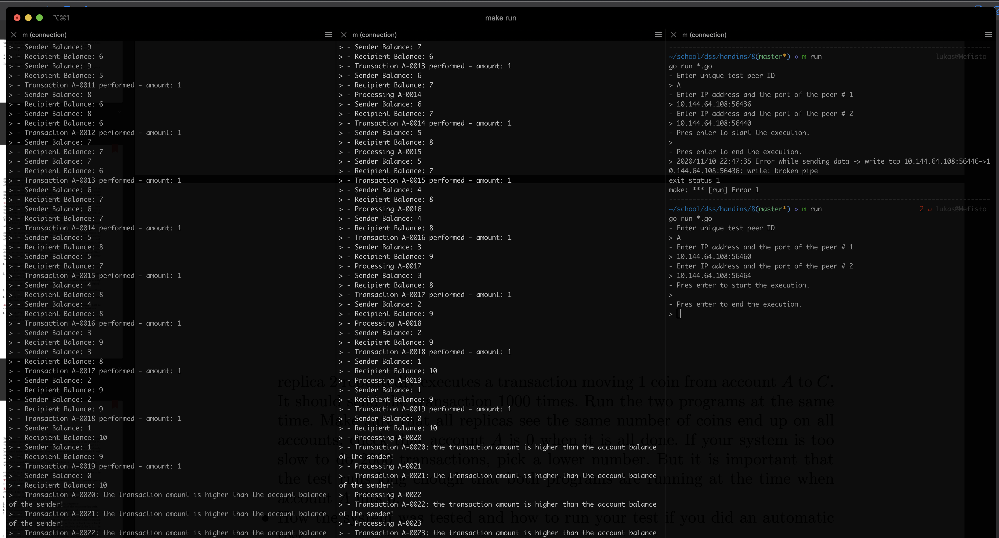

# Hand-in 8 Report
___
* *Hannah Eliza Schaible, Lukas Forst*
* Github Repository - [LukasForst/DSS](https://github.com/LukasForst/DSS/tree/master/handins/)
___

We tested the program exactly as described in the assignment.
See [test.go](test.go) - two parallel executors sending the transactions (just 40 in order to be fast),
on the screenshot

one can see that the sender balance is int the end `0` and just 20 transactions were processed
even though 40 was sent - all even to peer #1, the odd to peer #2.

To run it
1. go to `main.go`,
1. uncoment the `main`
1. run `make run`
1. hit enter
1. copy the IP address and the port (this is the peer #1)
1. run `make run`
1. put there the IP and port for peer #1
1. comment `main` in `main.go
1. go to `test.go`
1. comment `main` in `test.go`
1. run `make run`
1. enter `A`
1. enter IP of the peer #1
1. enter IP of the peer #2 (the output of the second peer)
1. hit enter
1. wait and enjoy